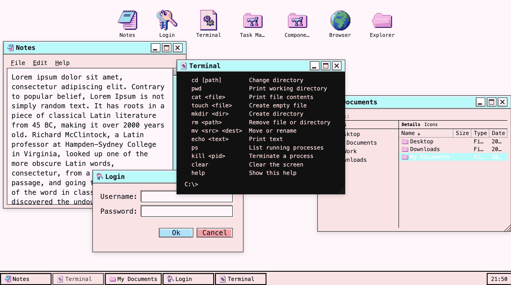

# DreamDesk UI

Retro-style windowing system for the browser. Available as vanilla Web Components (CDN / no build tools) and as a React component library.



---

## Architecture

```
packages/core/        — framework-agnostic logic (TypeScript)
  animations.ts       window open/close/minimize/fullscreen/snap FLIP animations
  drag.ts             pointer-based drag with container bounds + snap callbacks
  resize.ts           pointer-based resize with min/max clamping
  snap.ts             edge/corner snap zone detection + target rect calculation
  windowManager.ts    z-stack, focus, minimize registry, cascade positioning
  persistence.ts      localStorage save/restore per window id
  appRegistry.ts      dynamic app definitions for launch-on-demand
  progressBar.ts      animated fill logic
  theme.ts            data-theme switching
  dreamdesk.ts        Web Component shells consuming the above

packages/react/       — React component shells consuming core
  components/
    Desktop           context provider (WindowManager, container ref, taskbar height)
    Window            draggable, resizable, snappable OS window
    BrowserWindow     Window + IE-style toolbar + address bar
    TerminalWindow    Window styled as a terminal
    Taskbar           live window list + minimize/restore + clock
    DesktopIcon       icon + label shortcut
    MenuBar / Menu / MenuItem  dropdown menu bar
    Toolbar / ToolbarButton   icon-button toolbar row
    StatusBar / StatusBarSection  bottom status strip
    TreeView          expandable folder tree with keyboard navigation
    ListView          icon grid + sortable detail list view
    Dialog / DialogProvider  alert / confirm / prompt with Promise API
    ContextMenu / useContextMenu  right-click menu
    Checkbox / Radio / RadioGroup  retro form controls
    Select / Slider   styled native dropdown and range input
    Button            themed button (primary / ghost / help)
    Input             text / password field
    Toggle            on/off switch
    Tabs / Tab / TabPanel  tabbed content
    ProgressBar       linear fill, blocky or gradient variant
    Toast             alert / notification / warning pill
    Icon              SVG or image icon primitive

packages/os/          — OS platform layer (optional, @dreamdesk/os)
  fs/VirtualFS        in-memory filesystem (read/write/watch/serialize)
  fs/FSAdapter        pluggable persistence interface + LocalStorageAdapter
  process/ProcessManager  spawn/kill processes, extension→app routing
  shell/ShellEngine   command interpreter (ls/cd/cat/mkdir/rm/mv/ps/kill…)
  hooks/OSProvider    React context wiring FS + PM + app registry
```

**Rule:** all logic lives in `core`. React and Web Components are thin rendering shells. A fix in core lands in both renderers automatically.

`@dreamdesk/os` is fully optional — use DreamDesk purely as a component library without it.

---

## React — quick start

```tsx
import { Desktop, Window, Taskbar } from '@dreamdesk/react';

export function App() {
  return (
    <Desktop style={{ width: '100vw', height: '100vh' }}>
      <Window windowId="notes" title="Notes" width="560px" height="430px">
        <p>Hello world</p>
      </Window>
      <Taskbar />
    </Desktop>
  );
}
```

### Window props

| Prop | Type | Default | Description |
|---|---|---|---|
| `windowId` | string | — | Enables persistence + taskbar identity |
| `title` | string | `"Window"` | Title bar text |
| `icon` | string | — | SVG string or image URL |
| `width` / `height` | string | — | CSS length (`"640px"`, `"50vw"`) |
| `size` | `sm\|md\|lg` | — | Size token (alternative to explicit size) |
| `resizable` | boolean | `true` | |
| `movable` | boolean | `true` | |
| `defaultOpen` | boolean | `true` | Start hidden (open via `wm.open(id)`) |
| `disableMinimize/Fullscreen/Close` | boolean\|string | — | Disable button; string = tooltip |
| `bodyOverflow` | `auto\|hidden\|scroll` | — | |
| `scrollContent` | boolean | — | Wraps children in scrollable container |
| `fullscreenMode` | `"expand"` | — | Allow drag while fullscreen |
| `fullscreenAnimation` | function | — | Override built-in FLIP animation |
| `onMinimize` / `onFullscreen` / `onClose` | function | — | |
| `style` / `className` | — | — | Forwarded to host element |

### Window features
- Drag (header), resize (corner handle), both clamp to Desktop container
- Snap to edges and corners — preview overlay during drag, FLIP unsnap animation
- Minimize / restore with FLIP animation, registered in Taskbar automatically
- Fullscreen FLIP expand/contract animation
- Per-window localStorage persistence (position, size, open/closed, minimized) — requires `windowId`
- Z-stack managed by `WindowManager` — raise on click, cascade on open

### Taskbar

```tsx
<Taskbar showClock position="bottom" />
```

Renders all registered windows. Click = minimize/restore. Unregisters automatically on close.

### Imperative API

```tsx
const wm = useWindowManager(); // inside <Desktop>

wm.open('notes');       // show + animate in
wm.close('notes');      // animate out + hide
wm.raise('notes');      // bring to front
wm.minimize('notes');
wm.restore('notes');
```

---

## Web Components — CDN

```html
<html data-theme="pastelcore">
  <head>
    <script type="module" src="https://cdn.jsdelivr.net/npm/dreamdesk-ui@2/js/dreamdesk.js"></script>
  </head>
  <body>
    <dreamdesk-window title="Hello" width="420" height="260">
      <p>Content here</p>
    </dreamdesk-window>
  </body>
</html>
```

### Web Component attributes

`<dreamdesk-window>`: `title`, `width`, `height`, `size`, `resizable`, `movable`

`<dreamdesk-button>`: `variant` (`primary|ghost|help`), `size`, `action`

`<dreamdesk-progress-bar>`: `value` (0–100), `gradient`, `blocky`

---

## OS Platform (`@dreamdesk/os`)

An optional package that turns DreamDesk into a running OS simulation with a virtual filesystem, process manager, and system apps. Use it if you want persistent files, spawnable app processes, and a terminal — skip it if you just need the component library.

### Quick start

```tsx
import { OSProvider, useOS, VirtualFS, LocalStorageAdapter } from '@dreamdesk/os';

const fs = new VirtualFS();
fs.writeFile('/hello.txt', 'Hello world');

const adapter = new LocalStorageAdapter('my-app-fs'); // persists across reloads

function NotepadApp({ pid, args }) {
  const { fs, pm } = useOS();
  // read/write files, pm.kill(pid) to close
}

const APPS = {
  notepad: { component: NotepadApp, title: 'Notepad', extensions: ['txt', 'md'] },
};

export function App() {
  return (
    <Desktop>
      <OSProvider fs={fs} apps={APPS} adapter={adapter}>
        {/* your windows here */}
      </OSProvider>
    </Desktop>
  );
}
```

### VirtualFS

In-memory filesystem. All operations are synchronous and emit watch events.

```ts
fs.writeFile('/docs/readme.txt', 'hello');
fs.readFile('/docs/readme.txt');        // → 'hello'
fs.mkdir('/docs/archive');
fs.mv('/docs/readme.txt', '/docs/archive/readme.txt');
fs.rm('/docs/archive');
fs.ls('/docs');                         // → FSNode[]
fs.exists('/docs');                     // → boolean
fs.stat('/docs');                       // → FSNode

// React: re-render on any change
useEffect(() => fs.watch('/', cb), []);
```

### FSAdapter — persistence

```ts
interface FSAdapter {
  load(): Promise<string | null>;
  save(data: string): Promise<void>;
}
```

`LocalStorageAdapter` ships out of the box. Swap in IndexedDB, OPFS, or a remote API without touching VirtualFS or any app code:

```ts
// localStorage (default, ~5 MB limit)
new LocalStorageAdapter('my-key')

// bring your own:
class MyAdapter implements FSAdapter {
  async load() { /* fetch from server */ }
  async save(data) { /* POST to server */ }
}
```

### ProcessManager

```ts
const pid = pm.spawn('notepad', { args: { filePath: '/docs/readme.txt' } });
pm.kill(pid);
pm.list();           // running processes
pm.resolveApp('/docs/readme.txt'); // → 'notepad' (by extension)
```

### useOS hook

```tsx
const { fs, pm, open, openWith, appsFor } = useOS();

open('/docs/readme.txt');          // spawns registered app by extension
openWith('notepad', { filePath }); // spawn specific app
appsFor('txt');                    // all apps registered for .txt
```

### Shell engine

```ts
import { executeCommand, resolvePath, toWinPath } from '@dreamdesk/os';

executeCommand('ls /docs', { fs, pm, cwd: '/' });
// → { lines: ['  <DIR>  archive', '  5 B  readme.txt', ...] }
```

Built-in commands: `ls`, `cd`, `pwd`, `cat`, `touch`, `mkdir`, `rm`, `mv`, `echo`, `ps`, `kill`, `clear`, `help`.

---

## Themes

Set `data-theme` on `<html>`:

| Value | Description |
|---|---|
| `pastelcore` | Soft pastel Windows 9x aesthetic (default) |
| `vista` | Glass-inspired Vista style |
| `dark` | Dark variant |

---

---

## Development

```bash
pnpm install
pnpm --filter @dreamdesk/react dev    # React dev server
pnpm --filter @dreamdesk/core test    # run tests
```

## License

MIT
